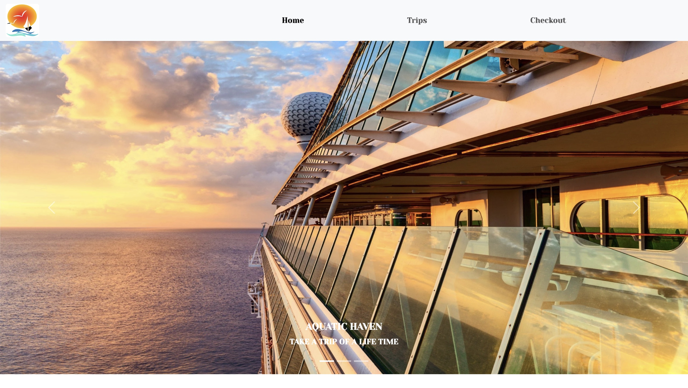

# FinalAssessmentT3
Final Assessment 


This is my final project for term 3 which uses css,html and javascript

[Watch the demo »](https://drive.google.com/drive/folders/1qjTUFTpwEHRITjqfIjTrW7mEzLY7ws-D)

## Table of Contents

* [About the Project](#about-the-project)
   * [Home](#home)
   * [Trips Page](#trips-page)
   *[Checkout Page](#checkout-page)
* [Getting Started](#getting-started)
  * [Installing](#installing)
* [Built With](#built-with)
* [Contributing](#contributing)
* [Authors](#authors)
* [License](#license)
* [Acknowledgements](#acknowledgements)

## About The Project

Aqautic Haven is a cruise ship website that sorts and filters throught available cruises.This type of website is usually associated with vacations.

### Home




### Trips Page


### Checkout Page


## Getting Started

These instructions will get you a copy of the project up and running on your local machine for development and testing purposes.

### Installing

1. Clone the repo
```sh
https://github.com/MA53GO/FinalAssessmentT3.git
```
2. Open the project

Use `Open Workspace` in Visual Studio.

## Built With

* [Javascript](https://developer.mozilla.org/en-US/docs/Web/JavaScript)
* [jQuery](https://jquery.com/)
* [Bootstrap](https://getbootstrap.com/)
* [Open Weather](https://openweathermap.org/)

## Contributing

Contributions are what make the open source community such an amazing place to be learn, inspire, and create. Any contributions you make are **greatly appreciated**.

1. Fork the Project
2. Create your Feature Branch (`git checkout -b feature/AmazingFeature`)
3. Commit your Changes (`git commit -m 'Add some AmazingFeature'`)
4. Push to the Branch (`git push origin feature/AmazingFeature`)
5. Open a Pull Request

## Authors

* **Paul Loots** - *Javascript & HTML* - [PaulLoots](https://github.com/PaulLoots)
* **Carlo Kuyper** - *Open Weather API* - [CarloOpenWindow](https://github.com/CarloOpenWindow)

See also the list of [contributors](https://github.com/paulowi/DV100-T3-Class-Project-Test/graphs/contributors) who participated in this project.

## License

This project is licensed under the MIT License - see the [LICENSE.md](LICENSE.md) file for details

## Acknowledgements

* Bootstrap
* Pinterest images
* Google images
